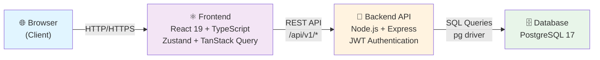
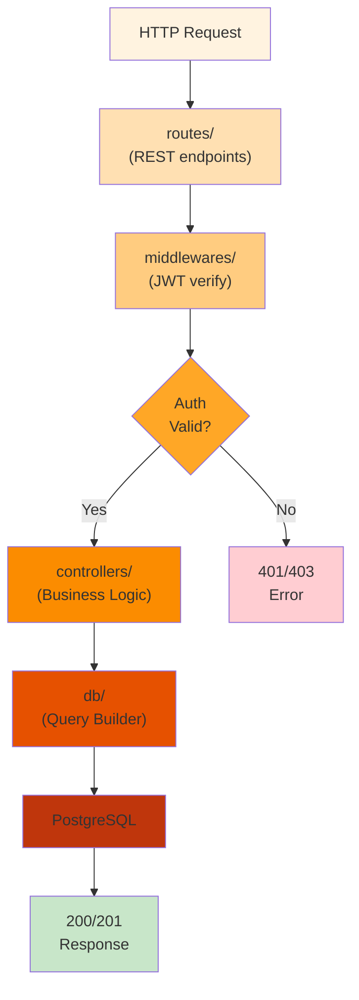
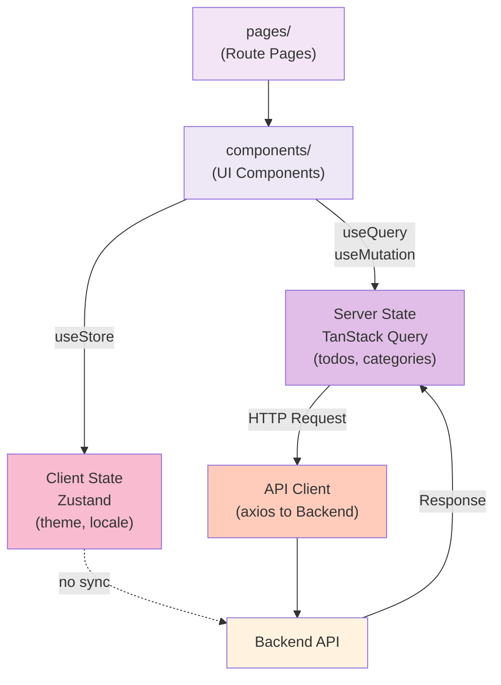
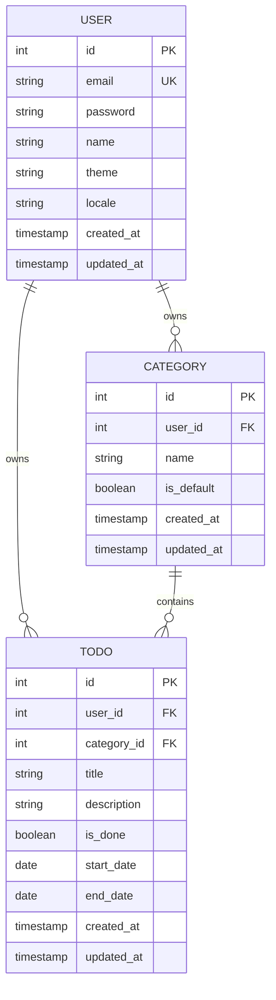

# 기술 아키텍처 다이어그램 - Todo List

| 항목       | 내용                                                           |
| ---------- | -------------------------------------------------------------- |
| 프로젝트명 | Todo List Application                                          |
| 버전       | 1.0.0                                                          |
| 작성일     | 2026-05-27                                                     |
| 범위       | 시스템 아키텍처, 백엔드 레이어, 프론트엔드 상태관리, DB 엔티티 |

---

## 1. 전체 시스템 구조

**설명**: 브라우저의 클라이언트에서 시작된 요청이 프론트엔드를 거쳐 REST API로 백엔드에 전달되고, 데이터베이스와 상호작용하는 전체 시스템의 단방향 흐름입니다.

---

## 2. 백엔드 레이어 흐름

**설명**: HTTP 요청이 라우트에서 받아져 JWT 인증 미들웨어를 거치고, 검증 실패 시 에러를 반환하며, 성공 시 컨트롤러와 데이터베이스 계층을 거쳐 응답을 반환합니다.

---

## 3. 프론트엔드 상태 관리 구조

**설명**: 페이지와 컴포넌트에서 서버 상태(TanStack Query)와 클라이언트 상태(Zustand)를 분리하여 관리합니다. 서버 상태는 API를 통해 백엔드와 동기화되고, 클라이언트 상태는 로컬에서만 관리됩니다.

---

## 4. DB 엔티티 관계

**설명**: User는 다수의 Category와 Todo를 소유하며, Category는 다수의 Todo를 포함합니다. 모든 엔티티는 타임스탬프와 기본키/외래키로 관계가 정의됩니다.

---

## 변경 이력

| 버전  | 날짜       | 변경사항                                                                                     |
| ----- | ---------- | -------------------------------------------------------------------------------------------- |
| 1.0.0 | 2026-05-27 | 초기 작성 - 4개 다이어그램 추가 (시스템 구조, 백엔드 레이어, 프론트엔드 상태관리, DB 엔티티) |
