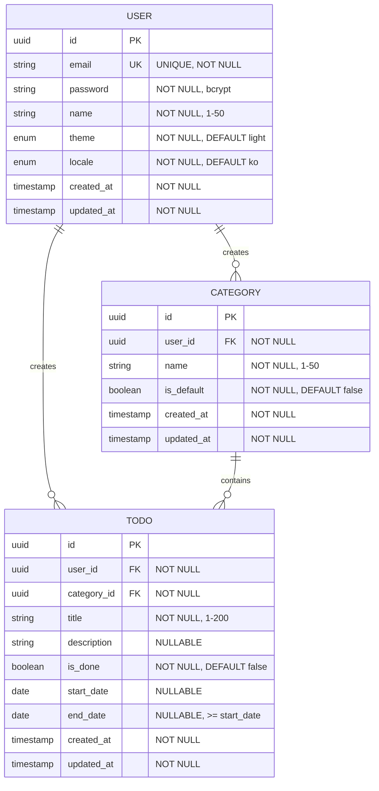

# ERD - Todo List

| 메타데이터 | 값 |
|:---|:---|
| 작성일 | 2026-05-27 |
| 버전 | 1.1 |
| 데이터베이스 | PostgreSQL 17 |
| 엔티티 수 | 3개 |

---

## 1. ERD 다이어그램



---

## 2. 관계 정의

### 2.1 관계 요약

| 관계 | 관계 유형 | 카디널리티 | 삭제 정책 | 비즈니스 의미 |
|:---|:---|:---|:---|:---|
| User ↔ Category | 1:N | 1 User → Many Categories | CASCADE | 사용자가 여러 개의 카테고리를 소유 |
| User ↔ Todo | 1:N | 1 User → Many Todos | CASCADE | 사용자가 여러 개의 할일을 생성 |
| Category ↔ Todo | 1:N | 1 Category → Many Todos | SET DEFAULT* | 카테고리에 여러 할일이 포함됨 |

*주: Category 삭제 시 해당 카테고리의 Todo는 기본 카테고리(is_default=true)로 자동 이관됨. 앱 레벨에서 처리.

### 2.2 관계 상세 설명

#### User ↔ Category (부모:자식 = 1:N)
- **정의**: 각 사용자(User)는 복수의 카테고리(Category)를 생성할 수 있음
- **외래키**: Category.user_id → User.id
- **삭제 정책**: User 삭제 시 해당 사용자의 모든 Category 연쇄 삭제 (ON DELETE CASCADE)
- **제약**: 동일 user_id 내에서 name은 중복 불가능

#### User ↔ Todo (부모:자식 = 1:N)
- **정의**: 각 사용자(User)는 복수의 할일(Todo)을 생성할 수 있음
- **외래키**: Todo.user_id → User.id
- **삭제 정책**: User 삭제 시 해당 사용자의 모든 Todo 연쇄 삭제 (ON DELETE CASCADE)
- **설명**: 각 할일은 명확한 소유자(사용자)를 가져야 함

#### Category ↔ Todo (부모:자식 = 1:N)
- **정의**: 각 카테고리(Category)는 복수의 할일(Todo)을 포함할 수 있음
- **외래키**: Todo.category_id → Category.id
- **삭제 정책**: Category 삭제 시 해당 카테고리의 Todo는 기본 카테고리로 이관 (앱 레벨 처리)
- **제약**: 할일 생성 시 category_id 미지정 시 기본 카테고리(is_default=true) 자동 적용
- **설명**: 사용자는 각 할일을 특정 카테고리로 분류 관리

---

## 3. 제약 조건

### 3.1 기본 제약 (Primary Key & Foreign Key)

| 엔티티 | 필드 | 제약 유형 | 대상 | 설명 |
|:---|:---|:---|:---|:---|
| User | id | PRIMARY KEY | - | 사용자 고유 식별자 (UUID) |
| Category | id | PRIMARY KEY | - | 카테고리 고유 식별자 (UUID) |
| Category | user_id | FOREIGN KEY | User.id | 카테고리 소유자 참조 |
| Todo | id | PRIMARY KEY | - | 할일 고유 식별자 (UUID) |
| Todo | user_id | FOREIGN KEY | User.id | 할일 작성자 참조 |
| Todo | category_id | FOREIGN KEY | Category.id | 할일 분류 카테고리 참조 |

### 3.2 유니크 제약 (UNIQUE)

| 엔티티 | 필드 | 범위 | 설명 |
|:---|:---|:---|:---|
| User | email | 전역 | 이메일 주소는 시스템 전체에서 유일해야 함 |
| Category | (user_id, name) | 사용자별 | 동일 사용자 내에서 카테고리 이름은 중복 불가 |

### 3.3 체크 제약 (CHECK)

| 엔티티 | 필드 | 조건 | 설명 |
|:---|:---|:---|:---|
| User | name | 1 ≤ length(name) ≤ 50 | 사용자 이름은 1~50자 |
| User | email | email 형식 | 유효한 이메일 주소 형식 |
| Category | name | 1 ≤ length(name) ≤ 50 | 카테고리 이름은 1~50자 |
| Category | is_default | BOOLEAN | true/false만 허용 |
| Todo | title | 1 ≤ length(title) ≤ 200 | 제목은 1~200자 |
| Todo | end_date | end_date >= start_date | 종료일은 시작일 이상이어야 함 |
| Todo | is_done | BOOLEAN | true/false만 허용 |

### 3.4 기본값 (DEFAULT)

| 엔티티 | 필드 | 기본값 | 설명 |
|:---|:---|:---|:---|
| User | theme | 'light' | 사용자 테마 초기값 |
| User | locale | 'ko' | 사용자 언어 설정 초기값 |
| Category | is_default | false | 카테고리는 기본값이 아님으로 초기화 |
| Todo | is_done | false | 할일은 미완료 상태로 초기화 |

### 3.5 NOT NULL 제약

| 엔티티 | 필드 | NOT NULL | 이유 |
|:---|:---|:---|:---|
| User | id, email, password, name, theme, locale, created_at, updated_at | O | 필수 정보 |
| Category | id, user_id, name, is_default, created_at, updated_at | O | 필수 정보 |
| Todo | id, user_id, category_id, title, is_done, created_at, updated_at | O | 필수 정보 |
| Todo | description, start_date, end_date | X | 선택적 정보 |

---

## 4. 인덱스

### 4.1 인덱스 전략

| 인덱스명 | 테이블 | 컬럼 | 유형 | 목적 | 우선순위 |
|:---|:---|:---|:---|:---|:---|
| idx_user_email | user | email | UNIQUE | 로그인 시 사용자 조회 | 필수 |
| idx_category_user_id | category | user_id | 단일 | 사용자의 카테고리 목록 조회 | 필수 |
| idx_todo_user_id | todo | user_id | 단일 | 사용자의 할일 목록 조회 | 필수 |
| idx_todo_category_id | todo | category_id | 단일 | 카테고리의 할일 목록 조회 | 필수 |
| idx_todo_user_category | todo | (user_id, category_id) | 복합 | 특정 사용자의 특정 카테고리 할일 조회 | 권장 |
| idx_todo_is_done | todo | is_done | 단일 | 완료/미완료 할일 필터링 | 권장 |

### 4.2 CREATE INDEX SQL

```sql
-- User 테이블 인덱스
-- UNIQUE 인덱스는 PRIMARY KEY와 함께 자동 생성되므로 추가 생성 불필요

-- Category 테이블 인덱스
CREATE INDEX idx_category_user_id ON category(user_id);

-- Todo 테이블 인덱스
CREATE INDEX idx_todo_user_id ON todo(user_id);
CREATE INDEX idx_todo_category_id ON todo(category_id);
CREATE INDEX idx_todo_user_category ON todo(user_id, category_id);
CREATE INDEX idx_todo_is_done ON todo(is_done);

-- 선택적: 기본 카테고리 빠른 조회
CREATE INDEX idx_category_user_id_is_default ON category(user_id, is_default) WHERE is_default = true;

-- 선택적: 기간별 할일 조회 최적화
CREATE INDEX idx_todo_start_date ON todo(start_date) WHERE start_date IS NOT NULL;
CREATE INDEX idx_todo_end_date ON todo(end_date) WHERE end_date IS NOT NULL;
```

### 4.3 인덱스 설명

#### idx_category_user_id
- **용도**: 특정 사용자의 모든 카테고리 조회 (`SELECT * FROM category WHERE user_id = ?`)
- **카디널리티**: 중간 (사용자당 평균 5~20개 카테고리)
- **업데이트 빈도**: 낮음

#### idx_todo_user_id
- **용도**: 특정 사용자의 모든 할일 조회 (`SELECT * FROM todo WHERE user_id = ?`)
- **카디널리티**: 높음 (사용자당 수십~수백 개 할일)
- **업데이트 빈도**: 높음

#### idx_todo_category_id
- **용도**: 특정 카테고리의 모든 할일 조회 (`SELECT * FROM todo WHERE category_id = ?`)
- **카디널리티**: 중간
- **업데이트 빈도**: 중간

#### idx_todo_user_category (복합 인덱스)
- **용도**: 특정 사용자의 특정 카테고리 할일 조회 (`SELECT * FROM todo WHERE user_id = ? AND category_id = ?`)
- **카디널리티**: 낮음~중간
- **업데이트 빈도**: 중간
- **주의**: (user_id, category_id) 순서로 생성 (쿼리 WHERE 절 순서와 일치)

---

## 5. 파생값 명세 (status)

### 5.1 status 파생값 정의

| 파생값 | 필드명 | 값 | 용도 |
|:---|:---|:---|:---|
| status | (파생값, DB 미저장) | `NOT_STARTED` \| `IN_PROGRESS` \| `DONE` \| `OVERDUE` | UI 표시, 필터링 |

### 5.2 상세 산출 로직

```
IF is_done = true
  → DONE

ELSE (is_done = false):
  IF start_date IS NULL OR end_date IS NULL
    → NOT_STARTED  (BR-06: 날짜 중 하나라도 미설정이면 NOT_STARTED)

  ELSE IF today > end_date
    → OVERDUE

  ELSE IF start_date <= today AND today <= end_date
    → IN_PROGRESS   (경계: today = start_date, today = end_date 모두 IN_PROGRESS)

  ELSE  (today < start_date)
    → NOT_STARTED
```

> **BR-06 참조**: `start_date` 또는 `end_date` 중 하나라도 없으면 status는 항상 `NOT_STARTED`

### 5.3 DB 미저장 이유

1. **중복 저장 방지**: is_done, start_date, end_date로 모든 상태를 표현 가능
2. **데이터 정규화**: 파생값은 저장하지 않는다는 정규화 원칙 준수
3. **일관성 보장**: 단일 진실 공급원(Single Source of Truth) 유지
4. **저장소 효율**: 불필요한 저장소 낭비 방지
5. **변경 관리 간소화**: 원본 필드만 변경하면 status는 자동 반영

### 5.4 구현 방식 (애플리케이션 레벨)

```typescript
type TodoStatus = "NOT_STARTED" | "IN_PROGRESS" | "DONE" | "OVERDUE";

interface TodoEntity {
  id: string;
  title: string;
  is_done: boolean;
  start_date: string | null;  // "YYYY-MM-DD"
  end_date: string | null;    // "YYYY-MM-DD"
}

interface TodoDTO extends TodoEntity {
  status: TodoStatus;  // 파생값
}

function deriveTodoStatus(todo: TodoEntity): TodoStatus {
  if (todo.is_done) return "DONE";

  if (!todo.start_date || !todo.end_date) return "NOT_STARTED";

  const today = new Date().toISOString().slice(0, 10);
  if (today > todo.end_date) return "OVERDUE";
  if (todo.start_date <= today && today <= todo.end_date) return "IN_PROGRESS";
  return "NOT_STARTED";
}
```

### 5.5 조회 시나리오

| 시나리오 | is_done | start_date | end_date | status |
|:---|:---|:---|:---|:---|
| 날짜 미설정 할일 생성 | false | null | null | NOT_STARTED |
| 시작 전 (오늘 < start_date) | false | 미래 | 미래 | NOT_STARTED |
| 진행 중 (start_date ≤ 오늘 ≤ end_date) | false | 과거/오늘 | 오늘/미래 | IN_PROGRESS |
| 기간 초과 (오늘 > end_date) | false | 과거 | 과거 | OVERDUE |
| 완료 처리 | true | 무관 | 무관 | DONE |

---

## 6. 데이터 타입 정의

### 6.1 사용자 정의 타입 (Enum)

#### theme Enum
```sql
CREATE TYPE theme_type AS ENUM ('light', 'dark');
```

**값 정의:**
- `light`: 밝은 테마 (기본값)
- `dark`: 어두운 테마

#### locale Enum
```sql
CREATE TYPE locale_type AS ENUM ('ko', 'en');
```

**값 정의:**
- `ko`: 한국어 (기본값)
- `en`: 영어

---

## 7. 기본 카테고리 규칙

### 7.1 기본 카테고리 정의

| 규칙 | 설명 |
|:---|:---|
| 생성 | 신규 사용자 생성 시 자동으로 기본 카테고리 1개 생성 (is_default=true) |
| 유일성 | 각 사용자당 is_default=true인 카테고리는 정확히 1개만 존재해야 함 |
| 이름 | 기본 카테고리 이름: "기본" (삭제 및 이름 수정 불가, BR-04) |
| 삭제 불가 | 기본 카테고리는 사용자가 삭제할 수 없음 (앱 레벨 검증) |
| 할일 이관 | 다른 카테고리 삭제 시 해당 카테고리의 할일은 기본 카테고리로 자동 이관 |

### 7.2 기본 카테고리 확인 쿼리

```sql
-- 특정 사용자의 기본 카테고리 조회
SELECT id, name FROM category 
WHERE user_id = $1 AND is_default = true;

-- 각 사용자마다 기본 카테고리가 정확히 1개인지 검증
SELECT user_id, COUNT(*) as default_count 
FROM category 
WHERE is_default = true 
GROUP BY user_id 
HAVING COUNT(*) != 1;
```

---

## 변경 이력

| 버전 | 날짜 | 변경 내용 | 작성자 |
|:---|:---|:---|:---|
| 1.1 | 2026-05-27 | status 4-state 로직 수정(BR-06 반영), 기본 카테고리명 '기본'으로 수정, PostgreSQL 17 명시 | ochlo |
| 1.0 | 2026-05-27 | 초기 ERD 작성 | ochlo |

---

## 부록: 마이그레이션 SQL 템플릿

### A.1 테이블 생성 스크립트

```sql
-- 타입 정의
CREATE TYPE theme_type AS ENUM ('light', 'dark');
CREATE TYPE locale_type AS ENUM ('ko', 'en');

-- User 테이블
CREATE TABLE "user" (
  id UUID PRIMARY KEY DEFAULT gen_random_uuid(),
  email VARCHAR(255) UNIQUE NOT NULL,
  password VARCHAR(255) NOT NULL,
  name VARCHAR(50) NOT NULL CHECK (length(name) >= 1 AND length(name) <= 50),
  theme theme_type NOT NULL DEFAULT 'light',
  locale locale_type NOT NULL DEFAULT 'ko',
  created_at TIMESTAMP NOT NULL DEFAULT CURRENT_TIMESTAMP,
  updated_at TIMESTAMP NOT NULL DEFAULT CURRENT_TIMESTAMP
);

-- Category 테이블
CREATE TABLE category (
  id UUID PRIMARY KEY DEFAULT gen_random_uuid(),
  user_id UUID NOT NULL REFERENCES "user"(id) ON DELETE CASCADE,
  name VARCHAR(50) NOT NULL CHECK (length(name) >= 1 AND length(name) <= 50),
  is_default BOOLEAN NOT NULL DEFAULT false,
  created_at TIMESTAMP NOT NULL DEFAULT CURRENT_TIMESTAMP,
  updated_at TIMESTAMP NOT NULL DEFAULT CURRENT_TIMESTAMP,
  UNIQUE(user_id, name)
);

-- Todo 테이블
CREATE TABLE todo (
  id UUID PRIMARY KEY DEFAULT gen_random_uuid(),
  user_id UUID NOT NULL REFERENCES "user"(id) ON DELETE CASCADE,
  category_id UUID NOT NULL REFERENCES category(id),
  title VARCHAR(200) NOT NULL CHECK (length(title) >= 1 AND length(title) <= 200),
  description TEXT,
  is_done BOOLEAN NOT NULL DEFAULT false,
  start_date DATE,
  end_date DATE CHECK (end_date IS NULL OR start_date IS NULL OR end_date >= start_date),
  created_at TIMESTAMP NOT NULL DEFAULT CURRENT_TIMESTAMP,
  updated_at TIMESTAMP NOT NULL DEFAULT CURRENT_TIMESTAMP
);

-- 인덱스 생성
CREATE INDEX idx_category_user_id ON category(user_id);
CREATE INDEX idx_todo_user_id ON todo(user_id);
CREATE INDEX idx_todo_category_id ON todo(category_id);
CREATE INDEX idx_todo_user_category ON todo(user_id, category_id);
CREATE INDEX idx_todo_is_done ON todo(is_done);
CREATE INDEX idx_category_user_id_is_default ON category(user_id, is_default) WHERE is_default = true;
```

### A.2 트리거 (선택사항: 기본 카테고리 자동 생성)

```sql
-- 신규 사용자 생성 시 기본 카테고리 자동 생성
CREATE OR REPLACE FUNCTION create_default_category()
RETURNS TRIGGER AS $$
BEGIN
  INSERT INTO category (user_id, name, is_default)
  VALUES (NEW.id, '기본', true);
  RETURN NEW;
END;
$$ LANGUAGE plpgsql;

CREATE TRIGGER user_create_default_category
AFTER INSERT ON "user"
FOR EACH ROW
EXECUTE FUNCTION create_default_category();
```

---

